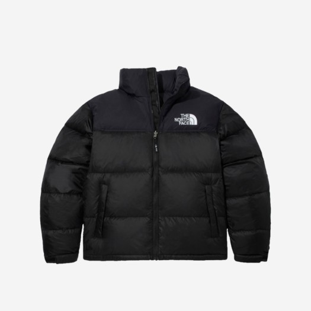

# KREAM-Product-Generator
Let's easily fine-tuning a pre-trained Stable Diffusion XL using `dataset-maker` and [LoRA](https://github.com/cloneofsimo/lora)!

**KREAM-Product-Generator** is a finetuned text-to-image generative model with a custom dataset collected from [KREAM](https://kream.co.kr/), one of the best online-resell market in Korea.
Have fun creating realistic, high-quality fashion items!

## Highlights
- [dataset-maker Instructions](https://github.com/hahminlew/easy-finetuning-stable-diffusion#dataset-maker-instructions)
- [Finetuning Stable Diffusion Instructions](https://github.com/hahminlew/easy-finetuning-stable-diffusion#finetuning-stable-diffusion-instructions)
- [Inference](https://github.com/hahminlew/easy-finetuning-stable-diffusion#inference)

## Dependencies

- python <= 3.11
- PyTorch 2.1.0
- Hugging Face 🤗: diffusers, transformers, datasets

I tested the conda environments on Linux, CUDA version 12.0, and NVIDIA Drivier Version 525.125.06.

****Please refer to [environment.yml](./environment.yml) for more details.***

```cd easy-finetuning-stable-diffusion```

```conda env create -f environment.yml```

```conda activate efsd```

```
pip install git+https://github.com/huggingface/diffusers
```

## dataset-maker Instructions

***KREAM Product Dataset Examples Collected by*** `dataset-maker`


`dataset-maker` is an example for a custom data collection tool to finetune the Stable Diffusion. It consists of web crawler and [BLIP image captioning module](https://github.com/salesforce/BLIP).

### KREAM Product Dataset from Hugging Face

[KREAM Product Blip Captions Dataset](https://huggingface.co/datasets/hahminlew/kream-product-blip-captions) is now available in Hugging Face 🤗.

```
from datasets import load_dataset

dataset = load_dataset("hahminlew/kream-product-blip-captions", split="train")
sample = dataset[0]
display(sample["image"].resize((256, 256)))
print(sample["text"])
```



```
outer, The North Face 1996 Eco Nuptse Jacket Black, a photography of the north face black down jacket
```

### Download KREAM Product Dataset from Scratch

1. Move [dataset.json](./dataset.json) file into desired save directory for KREAM Product Dataset.

```
mv ./dataset.json [/path/to/save]
```

```cd dataset-maker```

2. Run `download_KREAM.py`.

```
python download_KREAM.py --save_dir [/path/to/save]
```

3. Run `BLIP_captioning.py`. 

```
CUDA_LAUNCH_BLOCKING=1 python BLIP_captioning.py --dataset_dir [/path/to/dataset] --use_condition --text_condition 'a photography of'
```

BLIP captioning results will be saved in /path/to/save/[dataset_BLIP.json](./dataset_BLIP.json)

### Try Your Own Dataset Creation

```cd dataset-maker```

1. Inspect your desired website and slightly modify `webCrawler.py`.

**Please exercise caution when web crawling. Make sure to adhere to the website's crawling policies, which can be found in the '/robots.txt'.*

2. Run a modified `webCrawler.py`.

```
python webCrawler.py
```

3. Run `BLIP_captioning.py`.

```
CUDA_LAUNCH_BLOCKING=1 python BLIP_captioning.py --dataset_dir [/path/to/dataset] --use_condition --text_condition 'a photography of'
```

## Finetuning Stable Diffusion Instructions

I utilized `Hugging Face Diffusers Text-to-Image Examples` for finetuning a pre-trained Stable Diffusion XL with [LoRA](https://github.com/cloneofsimo/lora).

I finetuned the model under 4 NVIDIA GeForce RTX 3090 GPUs, and Memory-Usage was approximately 65GB.

```cd finetuning```

```bash
accelerate config default

huggingface-cli login

export MODEL_NAME="stabilityai/stable-diffusion-xl-base-1.0"
export VAE_NAME="madebyollin/sdxl-vae-fp16-fix"
export DATASET_NAME="hahminlew/kream-product-blip-captions"

CUDA_LAUNCH_BLOCKING=1 accelerate launch train_text_to_image_lora_sdxl.py \
  --pretrained_model_name_or_path=$MODEL_NAME \
  --pretrained_vae_model_name_or_path=$VAE_NAME \
  --dataset_name=$DATASET_NAME --caption_column="text" \
  --resolution=1024 --random_flip \
  --train_batch_size=1 \
  --num_train_epochs=3 --checkpointing_steps=500 \
  --learning_rate=1e-05 --lr_scheduler="constant" --lr_warmup_steps=0 \
  --mixed_precision="fp16" \
  --seed=42 \
  --output_dir="sdxl-kream-model-lora" \
  --validation_prompt="The Nike x Balenciaga down jacket black" --report_to="wandb" \
  --push_to_hub
```

If you want to resume training:

```bash
accelerate config default

huggingface-cli login

export MODEL_NAME="stabilityai/stable-diffusion-xl-base-1.0"
export VAE_NAME="madebyollin/sdxl-vae-fp16-fix"
export DATASET_NAME="hahminlew/kream-product-blip-captions"

CUDA_LAUNCH_BLOCKING=1 accelerate launch train_text_to_image_lora_sdxl.py \
  --pretrained_model_name_or_path=$MODEL_NAME \
  --pretrained_vae_model_name_or_path=$VAE_NAME \
  --dataset_name=$DATASET_NAME --caption_column="text" \
  --resolution=1024 --random_flip \
  --train_batch_size=1 \
  --num_train_epochs=3 --checkpointing_steps=500 \
  --learning_rate=1e-05 --lr_scheduler="constant" --lr_warmup_steps=0 \
  --mixed_precision="fp16" \
  --seed=42 \
  --output_dir="sdxl-kream-model-lora" \
  --validation_prompt="The Nike x Balenciaga down jacket black" --report_to="wandb" \
  --push_to_hub
  --resume_from_checkpoint="latest"
```

Or simply run:

```
sudo chmod +x run.sh
```

```
./run.sh
```

**Make sure you have Hugging Face and wandb account. You should create a directory and personal tokens for Hugging Face. Also, please check your personal API keys for wandb.*

## Inference

```
python inference.py --hub_username [your hugging face username] --prompt 'The Nike x Balenciaga down jacket black.' --img_name ***.png
```

Parameter Descriptions
- `num_inference_steps`: int, Number of diffusion steps
- `guidance_scale`: float, How similar the generated image will be to the prompt, 1 <= `guidance_scale` <= 50

## References

- [BLIP image captioning](https://github.com/salesforce/BLIP) and [BLIP Hugging Face Demo](https://huggingface.co/Salesforce/blip-image-captioning-large)
- [Hugging Face Dataset Creation Tutorial](https://huggingface.co/docs/datasets/create_dataset)
- [LoRA: Low-rank Adaptation for Fast Text-to-Image Diffusion Fine-tuning](https://github.com/cloneofsimo/lora)
- [Using LoRA for Efficient Stable Diffusion Fine-Tuning](https://huggingface.co/blog/lora)
- [Hugging Face Diffusers Text-to-Image Examples](https://github.com/huggingface/diffusers/tree/main/examples/text_to_image)
- [Finetuning Stable Diffusion from Lambda Labs ML](https://github.com/justinpinkney/stable-diffusion)